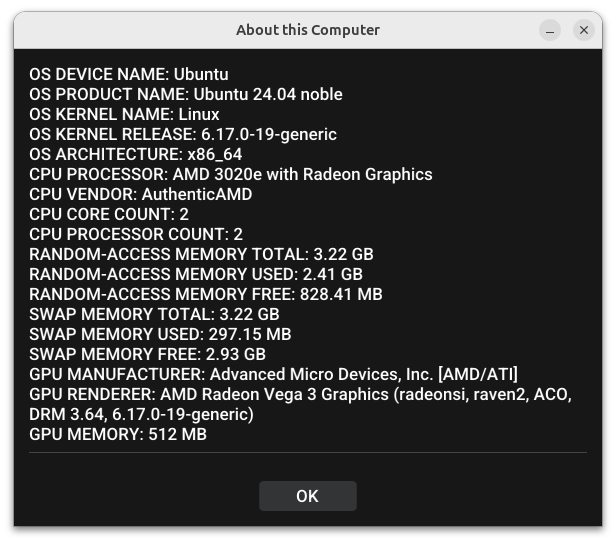

# System Information Graphical Utility (SIGU)

Welcome to SIGU, the System Information Graphical Utility! This small open source and permissively-licensed tool allows you to graphically display your OS Device Name, OS Product Name, OS Kernel Name, OS Kernel Release, OS Architecture, CPU Processor, CPU Vendor, CPU Core Count, CPU Processor Count, Random-Access Memory Total, Random-Access Memory Used, Random-Access Memory Free, Swap Memory Total, Swap Memory Used, Swap Memory Free, GPU Manufacturer, GPU Renderer, and GPU Memory. Similar to neofetch or fastfetch, but designed for graphical environments.

# Platforms

Supports Windows, macOS, Linux, FreeBSD, DragonFly BSD, NetBSD, OpenBSD, and SunOS.

**Build Dependencies:**
- Windows: git, curl, xxd, MSYS2, MinGW, pacman, g++, make, pkg-config, sdl2
- macOS: git, curl, xxd, Xcode command line tools, MacPorts, clang++, make, sdl2
- Linux: git, curl, xxd, g++, make, opengl, sdl2, x11, gtk+3.0, gio2.0, glib2.0, pkg-config, cmake
- FreeBSD: git, curl, xxd, clang++, make, opengl, sdl2, x11, gtk+3.0, gio2.0, glib2.0, pkg-config, cmake
- DragonFly BSD: git, curl, xxd, g++, make, hwloc, opengl, sdl2, x11, gtk+3.0, gio2.0, glib2.0, pkg-config, cmake
- NetBSD: git, curl, xxd, g++, make, hwloc, opengl, sdl2, x11, gtk+3.0, gio2.0, glib2.0, pkg-config, cmake
- OpenBSD: git, curl, xxd, clang++, make, opengl, sdl2, x11, gtk+3.0, gio2.0, glib2.0, pkg-config, cmake
- SunOS: git, curl, xxd, g++, make, hwloc, opengl, sdl2, x11, gtk+3.0, gio2.0, glib2.0, pkg-config, cmake

