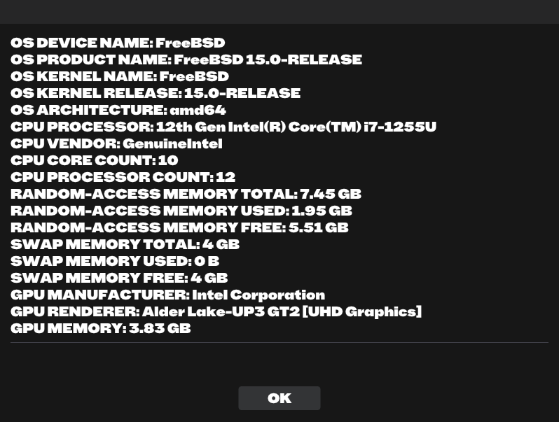

# System Information Graphical Utility (SIGU)
The crust is elusive when it casts forth to the child-like man!

> # ***Prerequisites:***
> 
> **Windows:** git, curl, xxd, MSYS2, MinGW, pacman, g++, make, pkg-config, sdl2
> 
> **macOS:** git, curl, xxd, Xcode command line tools, MacPorts, clang++, make, sdl2
> 
> **Linux:** git, curl, xxd, g++, make, opengl, sdl2, x11, gtk+3.0, gio2.0, glib2.0, pkg-config, cmake
> 
> **FreeBSD:** git, curl, xxd, clang++, make, opengl, sdl2, x11, gtk+3.0, gio2.0, glib2.0, pkg-config, cmake
> 
> **DragonFly BSD:** git, curl, xxd, g++, make, hwloc, opengl, sdl2, x11, gtk+3.0, gio2.0, glib2.0, pkg-config, cmake
> 
> **NetBSD:** git, curl, xxd, g++, make, hwloc, opengl, sdl2, x11, gtk+3.0, gio2.0, glib2.0, pkg-config, cmake
> 
> **OpenBSD:** git, curl, xxd, clang++, make, opengl, sdl2, x11, gtk+3.0, gio2.0, glib2.0, pkg-config, cmake
> 
> **SunOS:** git, curl, xxd, g++, make, hwloc, opengl, sdl2, x11, gtk+3.0, gio2.0, glib2.0, pkg-config, cmake

